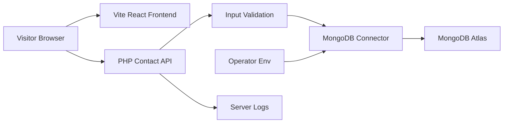

# portfolio2.0 Threat Model

## Executive Summary

The highest-risk areas are the public contact API boundary, MongoDB Atlas credentials, and deployment separation between the Vite frontend and PHP backend. The current changes remove hardcoded MySQL credentials, add environment-based MongoDB configuration, validate contact input, restrict CORS to configured origins, and prevent raw database errors from being returned to users.

## Scope And Assumptions

- In scope: `forms/contact.php`, `forms/test-mongodb.php`, `backend/*.php`, `.env.example`, `composer.json`, and frontend form submission behavior in `src/components/sections/Contact.jsx`.
- Out of scope: legacy static template assets under `assets/`, generated `dist/`, and third-party package internals under `vendor/`.
- Assumption: the contact API is intended to be internet-accessible.
- Assumption: submissions may contain personal contact data and should be treated as sensitive.
- Assumption: there is no user authentication for the contact form.
- Open question: which production PHP host will run the backend, and can it install `ext-mongodb`?
- Open question: what exact Vercel/frontend domains should be listed in `CORS_ALLOWED_ORIGINS`?

## System Model

### Primary Components

- Browser frontend: Vite/React app renders the portfolio and contact form. Evidence: `src/components/sections/Contact.jsx`.
- PHP API: `forms/contact.php` accepts contact messages and writes to MongoDB. Evidence: `forms/contact.php`.
- Health endpoint: `forms/test-mongodb.php` checks database reachability. Evidence: `forms/test-mongodb.php`.
- Configuration layer: `.env` variables loaded by `backend/env.php`; `.env.example` documents required values. Evidence: `backend/env.php`, `.env.example`.
- MongoDB connector: `backend/mongodb.php` creates the `MongoDB\Client` from environment variables. Evidence: `backend/mongodb.php`.
- MongoDB Atlas: external managed database configured by `MONGODB_URI`. Evidence: `.env.example`.

### Data Flows And Trust Boundaries

- Visitor browser -> React frontend: static HTML/CSS/JS over HTTPS when deployed. No authentication is present.
- Visitor browser -> PHP contact API: form fields cross an internet boundary over HTTP/HTTPS. Validation is performed in `forms/contact.php`; CORS is restricted by `backend/http.php`.
- PHP API -> MongoDB Atlas: validated submission data and credentials cross a backend-to-database boundary via MongoDB driver TLS/SRV behavior. Credentials come from `MONGODB_URI`.
- Operator -> backend environment: deployment secrets are configured outside source control. `.gitignore` excludes `.env`.
- PHP API -> server logs: generic exception class names are logged; raw database error messages are not returned to users.

#### Diagram

## Assets And Security Objectives

| Asset | Why it matters | Security objective |
|---|---|---|
| MongoDB Atlas URI | Grants database access | Confidentiality |
| Contact submissions | Contains names, emails, and messages | Confidentiality / Integrity |
| Contact API availability | Users need to send messages | Availability |
| Backend logs | Can leak operational details if verbose | Confidentiality |
| Frontend origin list | Controls which browser origins can call the API | Integrity |

## Attacker Model

### Capabilities

- Remote unauthenticated users can submit requests to `forms/contact.php`.
- Attackers can send malformed, oversized, or automated contact form input.
- Attackers may attempt cross-origin browser calls if CORS is too permissive.

### Non-Capabilities

- Attackers are not assumed to have server shell access.
- Attackers are not assumed to control backend environment variables.
- Attackers are not assumed to have MongoDB Atlas dashboard access.

## Entry Points And Attack Surfaces

| Surface | How reached | Trust boundary | Notes | Evidence |
|---|---|---|---|---|
| Contact submit | `POST /forms/contact.php` | Internet to PHP API | Validates length, email, required fields | `forms/contact.php` |
| MongoDB health | `GET /forms/test-mongodb.php` | Internet to PHP API | Returns generic health only | `forms/test-mongodb.php` |
| CORS handling | `Origin` request header | Browser origin to API | Allows configured origins only | `backend/http.php` |
| Env loading | `.env` / host env | Operator config to app | Secrets are not committed | `backend/env.php`, `.gitignore` |
| Database connection | PHP API to Atlas | Backend to external DB | Requires Composer package and `ext-mongodb` | `backend/mongodb.php`, `composer.json` |

## Top Abuse Paths

1. Credential leak -> attacker obtains committed or logged MongoDB URI -> connects to Atlas -> reads contact submissions.
2. Spam submission -> attacker scripts unauthenticated POST requests -> fills MongoDB collection -> raises cost or obscures real messages.
3. Oversized payload -> attacker sends very large fields -> consumes PHP memory or DB storage -> degrades backend availability.
4. CORS misconfiguration -> overly broad origins allow unwanted browser contexts -> third-party pages can submit form requests from users' browsers.
5. Verbose error exposure -> raw database exceptions leak hostnames or driver state -> attacker uses details to refine attacks.

## Threat Model Table

| Threat ID | Threat source | Prerequisites | Threat action | Impact | Impacted assets | Existing controls | Gaps | Recommended mitigations | Detection ideas | Likelihood | Impact severity | Priority |
|---|---|---|---|---|---|---|---|---|---|---|---|---|
| T1 | Remote attacker | Leaked URI or over-verbose logs | Use Atlas credentials directly | Contact data disclosure | MongoDB URI, submissions | `.env` ignored; `.env.example` placeholder; generic user errors | Atlas IP allowlist and least-privilege DB user not visible in repo | Use restricted Atlas DB user, rotate the credential from the prompt, enforce Atlas network controls | Atlas auth failures, unusual read volume | Medium | High | High |
| T2 | Remote attacker | Public contact endpoint | Submit spam or repeated valid messages | Storage/cost growth, inbox noise | API availability, submissions | Required fields, length limits | No CAPTCHA, rate limiting, or abuse scoring | Add rate limit at backend/CDN, optional CAPTCHA/honeypot, per-IP throttling | 4xx/2xx volume spikes, repeated `ipHash` | High | Medium | High |
| T3 | Remote attacker | Public endpoint accepts POST bodies | Send malformed or oversized input | Resource exhaustion | PHP API availability | Field truncation and validation in `forms/contact.php` | Web server body size limit not visible | Set max body size in PHP host/web server, reject non-form content types | 413/422 spikes, memory alerts | Medium | Medium | Medium |
| T4 | Malicious website | Overly broad CORS config | Submit cross-origin browser requests | Unwanted writes | API integrity | Origin allowlist in `backend/http.php` | Exact production origins not known | Set only real Vercel/custom domains in `CORS_ALLOWED_ORIGINS` | Requests by unexpected Origin | Medium | Medium | Medium |
| T5 | Opportunistic scanner | Health endpoint public | Probe backend status | Service fingerprinting | Deployment metadata | Generic JSON error and no `X-Powered-By` | Endpoint still confirms API existence | Keep generic, consider protecting health endpoint by environment or shared token | Repeated health probes | Medium | Low | Low |

## Recommended Focus Paths

- `forms/contact.php`: primary untrusted input handling and database write path.
- `forms/test-mongodb.php`: public health endpoint behavior.
- `backend/http.php`: CORS, response headers, and error response format.
- `backend/mongodb.php`: secrets consumption and database connection checks.
- `.env.example`: deployment contract for secrets and CORS.
- `src/components/sections/Contact.jsx`: frontend form target and expected response handling.

## Quality Check

- Covered discovered entry points: contact submit and MongoDB health endpoint.
- Covered trust boundaries: browser to API, API to Atlas, operator env to backend, API to logs.
- Separated runtime from build/development tooling.
- Open assumptions are listed above because production PHP hosting details are not yet known.
- Threats are tied to repo evidence and current mitigations.
